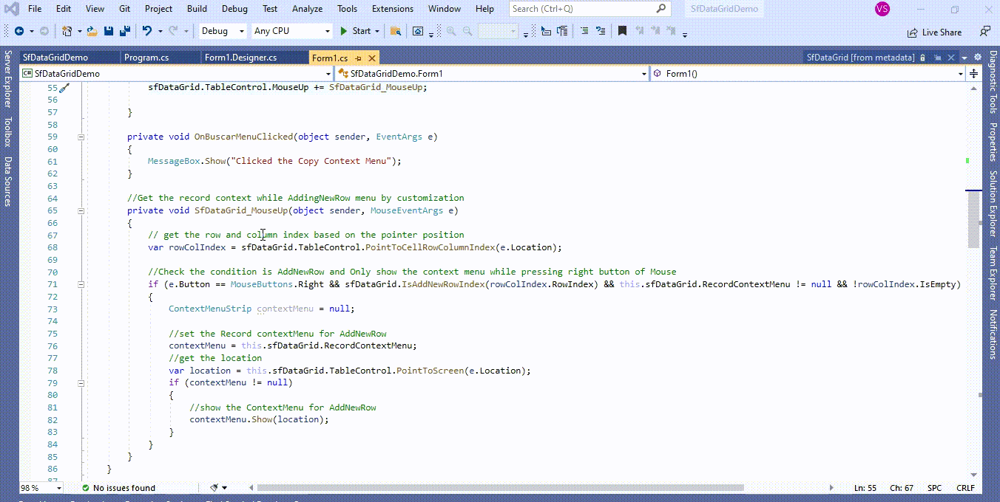
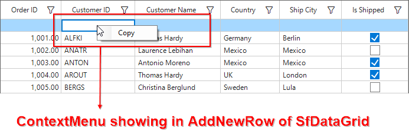

# How to show the context menu while adding a new record using AddNewRow in WinForms DataGrid (SfDataGrid)?

## About the sample
This example illustrates how to show the context menu while adding a new record using AddNewRow in [WinForms DataGrid](https://www.syncfusion.com/winforms-ui-controls/datagrid) (SfDataGrid)?

[WinForms DataGrid](https://www.syncfusion.com/winforms-ui-controls/datagrid) (SfDataGrid) does not provide the direct support to showing Context Menu in **AddNewRow**. You can achieve your requirement by customization the **MouseUp** event in [SfDataGrid.TableControl](https://help.syncfusion.com/cr/windowsforms/Syncfusion.WinForms.DataGrid.SfDataGrid.html#Syncfusion_WinForms_DataGrid_SfDataGrid_TableControl).

```C#
sfDataGrid.TableControl.MouseUp += SfDataGrid_MouseUp;

//Get the record context while AddingNewRow menu by customization 
private void SfDataGrid_MouseUp(object sender, MouseEventArgs e)
{
            // get the row and column index based on the pointer position 
            var rowColIndex = sfDataGrid.TableControl.PointToCellRowColumnIndex(e.Location);

            //Check the condition is AddNewRow and Only show the context menu while pressing right button of Mouse
            if (e.Button == MouseButtons.Right && sfDataGrid.IsAddNewRowIndex(rowColIndex.RowIndex) && this.sfDataGrid.RecordContextMenu != null && !rowColIndex.IsEmpty)
            {
                ContextMenuStrip contextMenu = null;

                //set the Record contextMenu for AddNewRow
                contextMenu = this.sfDataGrid.RecordContextMenu;
                //get the location 
                var location = this.sfDataGrid.TableControl.PointToScreen(e.Location);
                if (contextMenu != null)
                {
                    //show the ContextMenu for AddNewRow
                    contextMenu.Show(location);
                }
            }
}

```


The following screenshot shows the ContextMenu in AddNewRow in [WinForms DataGrid](https://www.syncfusion.com/winforms-ui-controls/datagrid) (SfDataGrid),



Take a moment to peruse the [WinForms DataGrid - Context Menu](https://help.syncfusion.com/windowsforms/datagrid/interactivefeatures#context-menu) documentation, where you can find about Context Menu with code examples.

Please refer this [link](https://www.syncfusion.com/winforms-ui-controls/datagrid) to know about the essential features of WinForms DataGrid.

## Requirements to run the demo
Visual Studio 2015 and above versions
